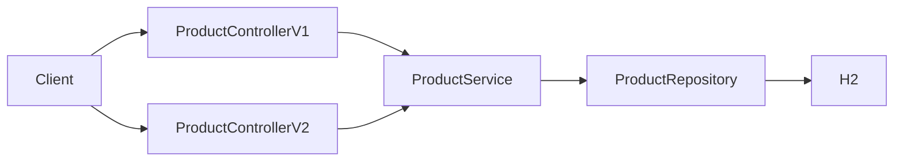

# Migration Demo

Demo application for migrating from Spring Boot 3.5 to Spring Boot 4. The app currently runs on Spring Boot 3.5 and is intended as a baseline for a future upgrade to Spring Boot 4.

## Prerequisites

- Java 25
- Gradle (or use the included wrapper: `./gradlew`)

## Tech stack

- Spring Boot 3.5
- Spring Web, Data JPA, Validation, Actuator
- Spring Cloud Resilience4j
- SpringDoc OpenAPI (Swagger UI)
- H2 (in-memory database)
- Lombok

## Getting started

```bash
./gradlew bootRun
```

Run tests:

```bash
./gradlew test
```

## API overview

| Method | Endpoint | Description |
|--------|----------|-------------|
| GET | `/api/v1/products` | Returns a list of product names |
| POST | `/api/v1/products` | Creates a product |
| GET | `/api/v2/products` | Returns a list of products (name, price) |
| POST | `/api/v2/products` | Creates a product |

**Create product** (v1 or v2): send a JSON body:

```json
{ "name": "Product name", "price": 9.99 }
```

API documentation is available via Swagger UI at `/swagger-ui.html` when the application is running.

## Request flow



## Project structure

```
src/main/java/com/felipestanzani/migrationdemo/
├── MigrationdemoApplication.java   # Main application class
├── controller/
│   ├── ProductControllerV1.java   # API v1: product names
│   └── ProductControllerV2.java   # API v2: full product responses
├── dto/
│   ├── ProductRequest.java
│   └── ProductResponse.java
├── model/
│   └── Product.java
├── repository/
│   └── ProductRepository.java
└── service/
    ├── contract/
    │   └── ProductService.java
    └── ProductServiceImpl.java
```

## License

This project is licensed under the MIT License. See [LICENSE.md](LICENSE.md) for details.
